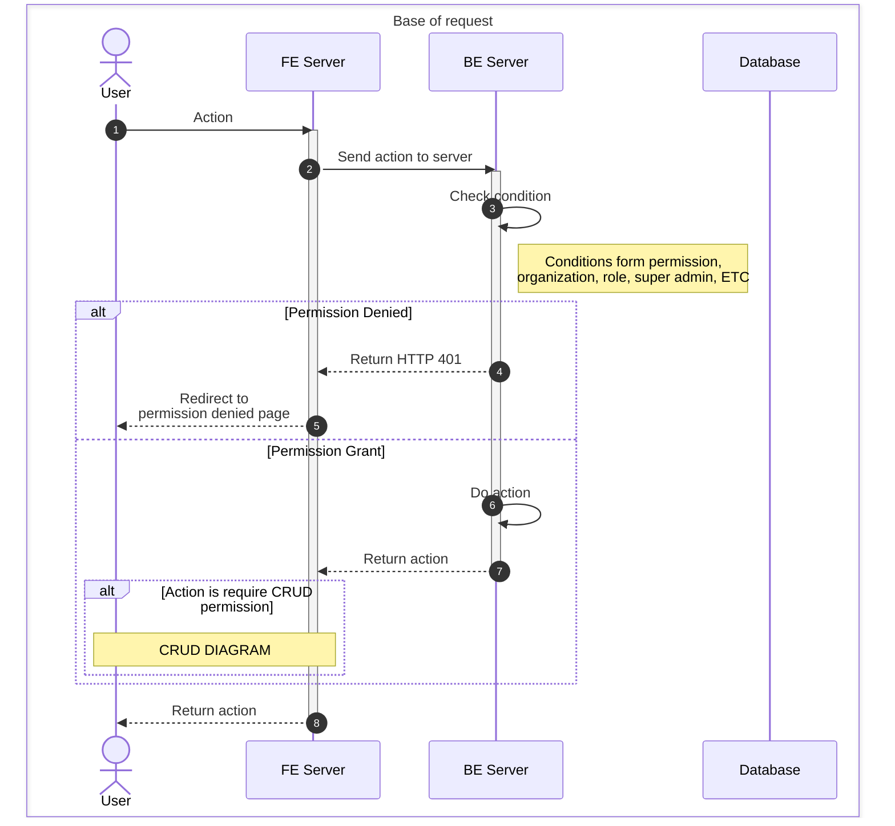

```mermaid
sequenceDiagram
    autonumber
    
    box Base of request
        actor USR as User
        participant FE as FE Server
        participant BE as BE Server
        participant DB as Database
    end

    USR ->> FE: Action
    activate FE
    FE ->> BE: Send action to server
    activate BE
    BE ->> BE: Check condition 
    note right of BE: Conditions form permission, <br> organization, role, super admin, ETC
    alt Permission Denied
        BE -->> FE: Return HTTP 401
        FE -->> USR: Redirect to <br> permission denied page 
    else Permission Grant
        BE ->> BE: Do action
        BE -->> FE: Return action
        deactivate BE
        alt Action is require CRUD permission
            note over USR, FE: CRUD DIAGRAM
        end
    end
    FE -->> USR: Return action
    deactivate FE
```
