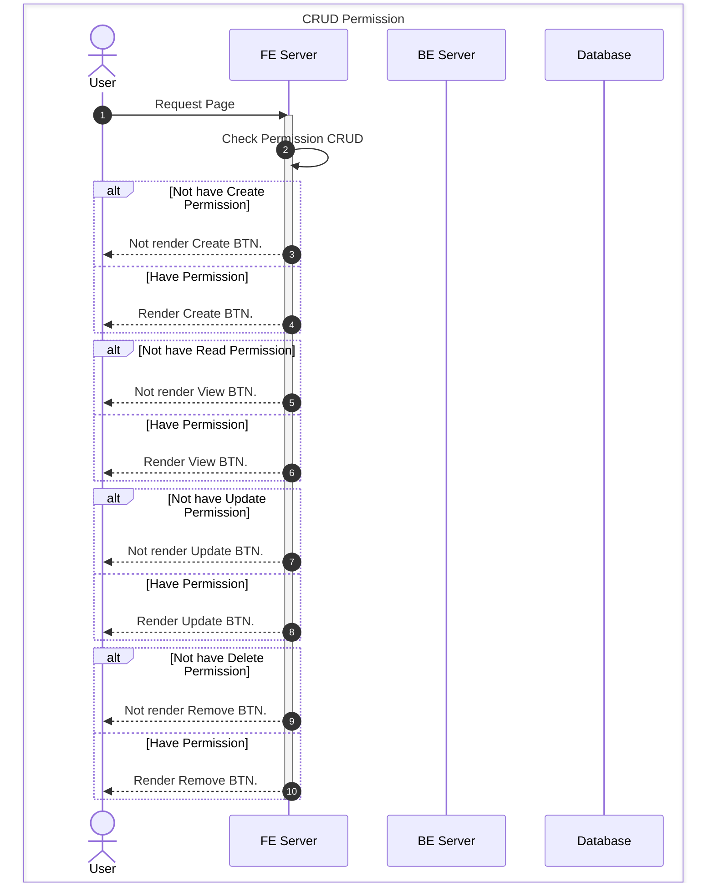

```mermaid
sequenceDiagram
    autonumber
    
    box CRUD Permission
        actor USR as User
        participant FE as FE Server
        participant BE as BE Server
        participant DB as Database
    end

    USR ->> FE: Request Page
    activate FE
        FE ->> FE: Check Permission CRUD
        alt Not have Create Permission
            FE -->> USR: Not render Create BTN.
        else Have Permission
            FE -->> USR: Render Create BTN.
        end
        alt Not have Read Permission
            FE -->> USR: Not render View BTN.
        else Have Permission
            FE -->> USR: Render View BTN.
        end
        alt Not have Update Permission
            FE -->> USR: Not render Update BTN.
        else Have Permission
            FE -->> USR: Render Update BTN.
        end
        alt Not have Delete Permission
            FE -->> USR: Not render Remove BTN.
        else Have Permission
            FE -->> USR: Render Remove BTN.
        end
    deactivate FE

```