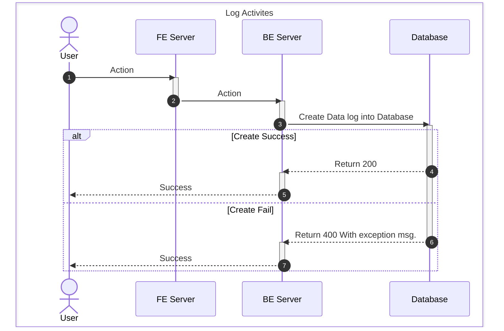

```mermaid
sequenceDiagram
    autonumber
    
    box Log Activites
        actor USR as User
        participant FE as FE Server
        participant BE as BE Server
        participant DB as Database
    end

    USR ->> FE: Action
    activate FE
    FE ->> BE: Action
    deactivate FE
    activate BE
    BE ->> DB: Create Data log into Database
    deactivate BE
    activate DB

    alt Create Success
        DB -->> BE: Return 200
        activate BE
        BE -->> USR: Success
        deactivate BE
    else Create Fail
        DB -->> BE: Return 400 With exception msg.
        deactivate DB
        activate BE
        BE -->> USR: Success
        deactivate BE
    end    
```