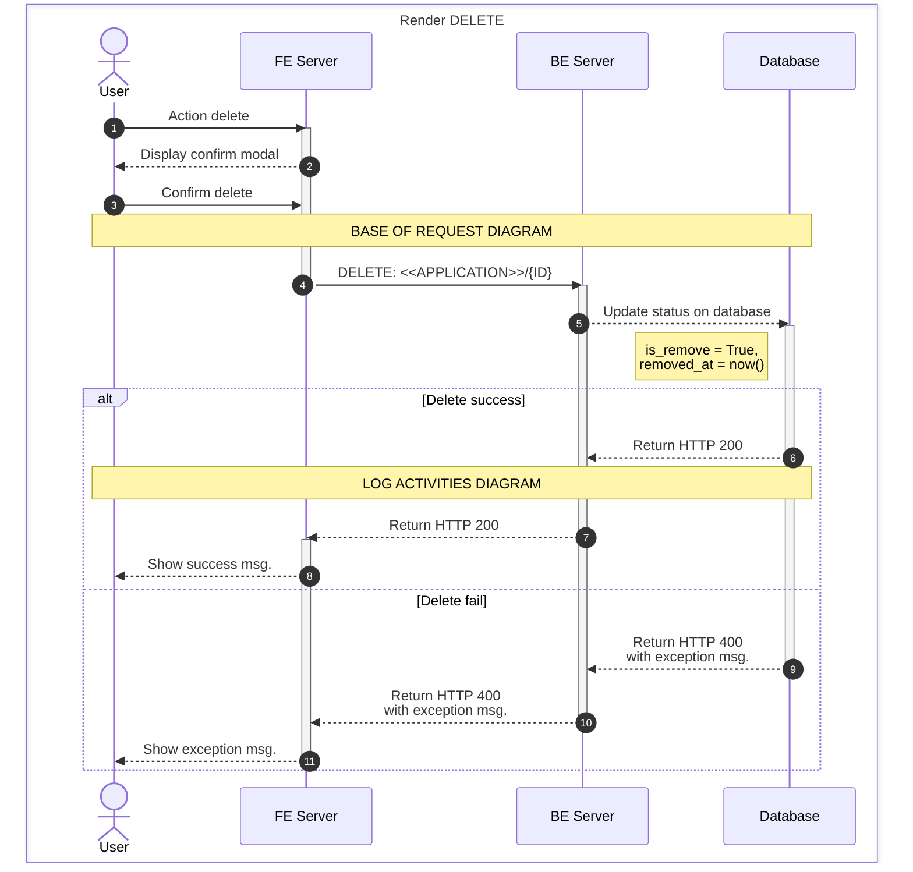

```mermaid
sequenceDiagram
    autonumber
    
    box Render DELETE
        actor USR as User
        participant FE as FE Server
        participant BE as BE Server
        participant DB as Database
    end

    USR ->> FE: Action delete
    activate FE
    FE -->> USR: Display confirm modal
    USR ->> FE: Confirm delete
    note over USR, DB: BASE OF REQUEST DIAGRAM
    FE ->> BE: DELETE: <<APPLICATION>>/{ID}
    deactivate FE
    activate BE
    BE -->> DB: Update status on database
    activate DB
    note left of DB: is_remove = True, <br> removed_at = now()
    alt Delete success
        DB -->> BE: Return HTTP 200
        note over USR, DB: LOG ACTIVITIES DIAGRAM
        BE -->> FE: Return HTTP 200
        activate FE
        FE -->> USR: Show success msg.
    else Delete fail
        DB -->> BE: Return HTTP 400 <br> with exception msg.
        deactivate DB
        BE -->> FE: Return HTTP 400 <br> with exception msg.
        deactivate BE
        FE -->> USR: Show exception msg.
        deactivate FE
    end
```