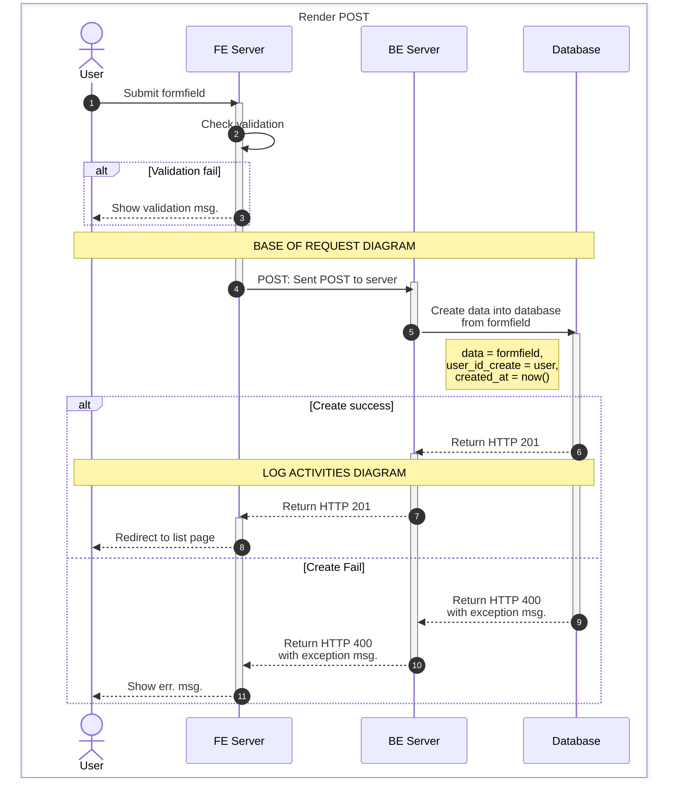

```mermaid
sequenceDiagram
    autonumber
    
    box Render POST
        actor USR as User
        participant FE as FE Server
        participant BE as BE Server
        participant DB as Database
    end

   USR ->> FE: Submit formfield
    activate FE
    FE ->> FE: Check validation
    alt Validation fail
        FE -->> USR: Show validation msg.
    end
    note over USR, DB: BASE OF REQUEST DIAGRAM
    FE ->> BE: POST: Sent POST to server
    activate BE
    deactivate FE
    BE ->> DB: Create data into database <br> from formfield
    deactivate BE
    activate DB
    note left of DB: data = formfield, <br> user_id_create = user, <br> created_at = now()
    alt Create success
        DB -->> BE: Return HTTP 201
        activate BE
        note over USR, DB: LOG ACTIVITIES DIAGRAM
        BE -->> FE: Return HTTP 201
        activate FE
        FE -->> USR: Redirect to list page
    else Create Fail
        DB -->> BE: Return HTTP 400 <br> with exception msg.
        deactivate DB
        BE -->> FE: Return HTTP 400 <br> with exception msg.
        deactivate BE
        FE -->> USR: Show err. msg.
        deactivate FE
    end
```