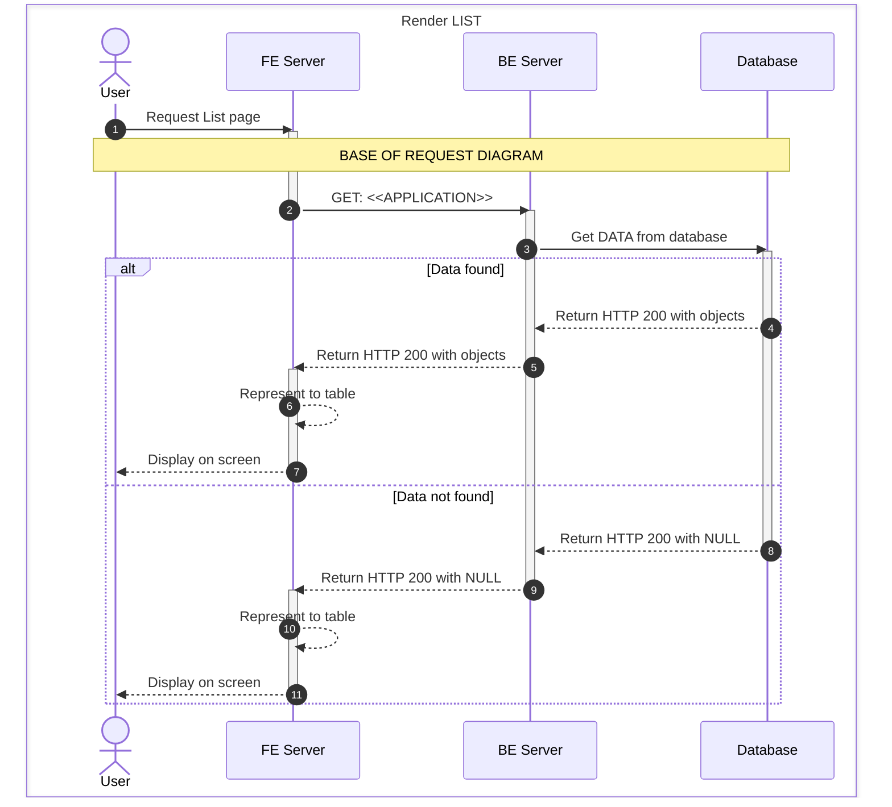

```mermaid
sequenceDiagram
    autonumber
    
    box Render LIST
        actor USR as User
        participant FE as FE Server
        participant BE as BE Server
        participant DB as Database
    end

    USR ->> FE: Request List page
    activate FE
    note over USR, DB: BASE OF REQUEST DIAGRAM
    FE ->> BE: GET: <<APPLICATION>>
    deactivate FE
    activate BE
    BE ->> DB: Get DATA from database
    activate DB
    alt Data found
        DB -->> BE: Return HTTP 200 with objects
        BE -->> FE: Return HTTP 200 with objects
        activate FE
        FE -->> FE: Represent to table
        FE -->> USR: Display on screen
        deactivate FE
    else Data not found
        DB -->> BE: Return HTTP 200 with NULL
        deactivate DB
        BE -->> FE: Return HTTP 200 with NULL
        deactivate BE
        activate FE
        FE -->> FE: Represent to table
        FE -->> USR: Display on screen
        deactivate FE
    end
```