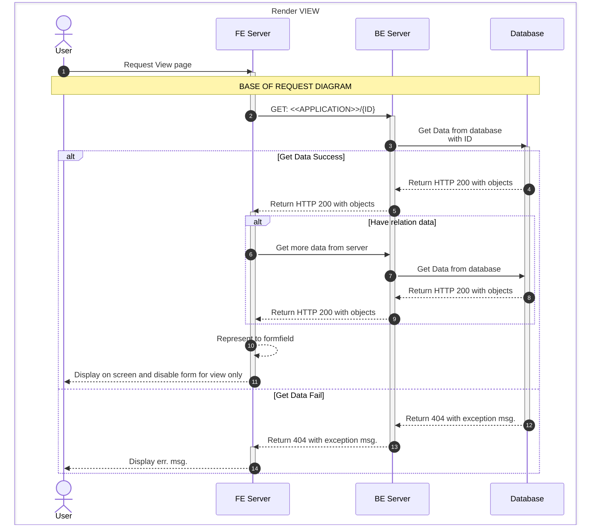

```mermaid
sequenceDiagram
    autonumber
    
    box Render VIEW
        actor USR as User
        participant FE as FE Server
        participant BE as BE Server
        participant DB as Database
    end

    USR ->> FE: Request View page
    activate FE
    note over USR, DB: BASE OF REQUEST DIAGRAM
    FE ->> BE: GET: <<APPLICATION>>/{ID}
    deactivate FE
    activate BE
    BE ->> DB: Get Data from database <br> with ID
    activate DB
    alt Get Data Success
        DB -->> BE: Return HTTP 200 with objects
        BE -->> FE: Return HTTP 200 with objects
        activate FE
        alt Have relation data
            FE ->> BE: Get more data from server
            BE ->> DB: Get Data from database
            DB -->> BE: Return HTTP 200 with objects
            BE -->> FE: Return HTTP 200 with objects
        end
        FE -->> FE: Represent to formfield
        FE -->> USR: Display on screen and disable form for view only
        deactivate FE
    else Get Data Fail
        DB -->> BE: Return 404 with exception msg.
        deactivate DB
        BE -->> FE: Return 404 with exception msg.
        deactivate BE
        activate FE
        FE -->> USR: Display err. msg.
        deactivate FE
    end
```