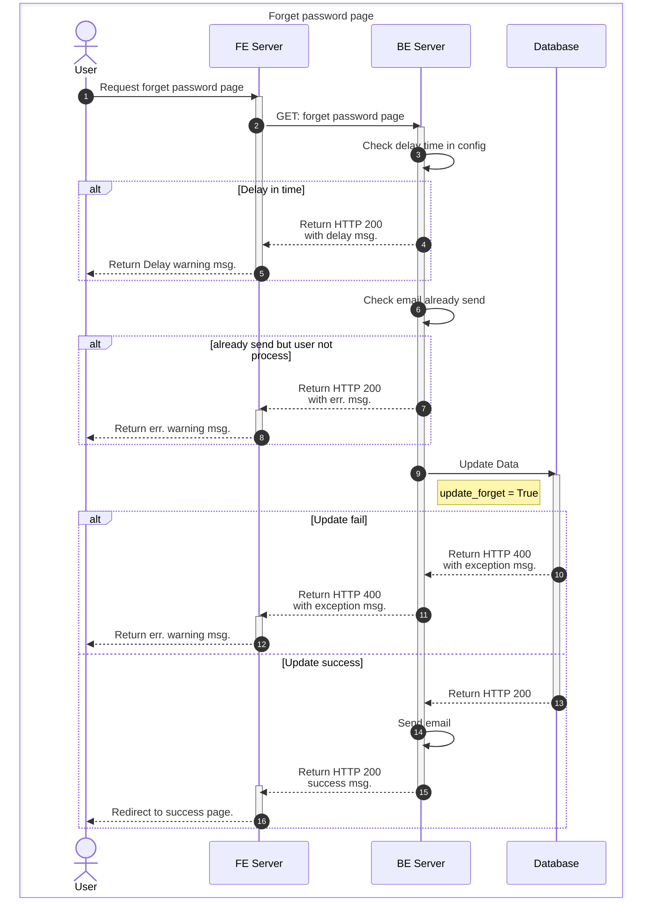
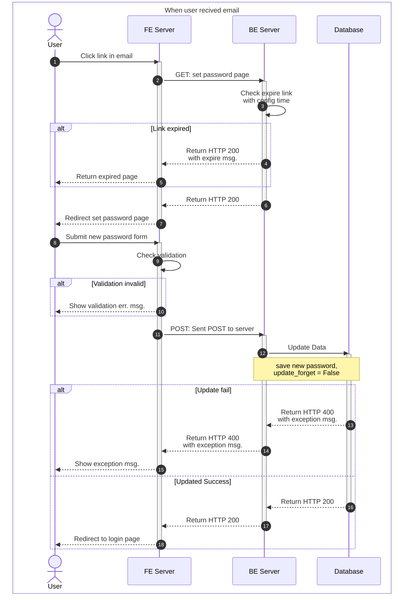

```mermaid
sequenceDiagram
    autonumber
    
    box Forget password page
        actor USR as User
        participant FE as FE Server
        participant BE as BE Server
        participant DB as Database
    end

    USR ->> FE: Request forget password page
    activate FE
    FE ->> BE: GET: forget password page
    activate BE
    BE ->> BE: Check delay time in config
    alt Delay in time
        BE -->> FE: Return HTTP 200 <br> with delay msg.
        FE -->> USR: Return Delay warning msg.
        deactivate FE
    end
    BE ->> BE: Check email already send
    alt already send but user not process
        BE -->> FE: Return HTTP 200 <br> with err. msg.
        activate FE
        FE -->> USR: Return err. warning msg.
        deactivate FE
    end
    BE ->> DB: Update Data
    activate DB
    Note right of BE: update_forget = True
    alt Update fail
        DB -->> BE: Return HTTP 400 <br> with exception msg.
        BE -->> FE: Return HTTP 400 <br> with exception msg.
        activate FE
        FE -->> USR: Return err. warning msg.
        deactivate FE
    else Update success
        DB -->> BE: Return HTTP 200
        deactivate DB
        BE ->> BE: Send email
        BE -->> FE: Return HTTP 200 <br> success msg.
        activate FE
        deactivate BE
        FE -->> USR: Redirect to success page.
        deactivate FE
    end
```

```mermaid
sequenceDiagram
    autonumber
    
    box When user recived email
        actor USR as User
        participant FE as FE Server
        participant BE as BE Server
        participant DB as Database
    end

    USR ->> FE: Click link in email
    activate FE
    FE ->> BE: GET: set password page
    activate BE
    BE ->> BE: Check expire link <br> with config time
    alt Link expired
        BE -->> FE: Return HTTP 200 <br> with expire msg.
        FE -->> USR: Return expired page
    end
    BE -->> FE: Return HTTP 200
    deactivate BE
    FE -->> USR: Redirect set password page
    deactivate FE
    USR ->> FE: Submit new password form
    activate FE
    FE ->> FE: Check validation
    alt Validation invalid
        FE -->> USR: Show validation err. msg.
    end
    FE ->> BE: POST: Sent POST to server
    activate BE
    BE ->> DB: Update Data
    activate DB
    Note over BE, DB: save new password, <br> update_forget = False
    alt Update fail
        DB -->> BE: Return HTTP 400 <br> with exception msg.
        BE -->> FE: Return HTTP 400 <br> with exception msg.
        FE -->> USR: Show exception msg.
    else Updated Success
        DB -->> BE: Return HTTP 200
        deactivate DB
        BE -->> FE: Return HTTP 200
        deactivate BE
        FE -->> USR: Redirect to login page
    end
    deactivate FE
```