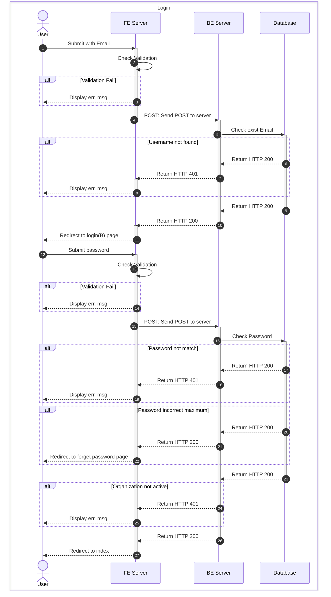

```mermaid
sequenceDiagram
    autonumber
    
    box Login
        actor USR as User
        participant FE as FE Server
        participant BE as BE Server
        participant DB as Database
    end

    USR ->> FE: Submit with Email
    activate FE

    FE ->> FE: Check Validation
    alt Validation Fail
        FE -->> USR: Display err. msg.
    end

    FE ->> BE: POST: Send POST to server
    deactivate FE
    activate BE
    BE ->> DB: Check exist Email                                            
    activate DB
    alt Username not found
        DB -->> BE: Return HTTP 200
        BE -->> FE: Return HTTP 401
        activate FE
        FE -->> USR: Display err. msg.
        deactivate FE
    end
    DB -->> BE: Return HTTP 200
    deactivate DB
    BE -->> FE: Return HTTP 200
    deactivate BE
    activate FE
    FE -->> USR: Redirect to login(B) page
    deactivate FE

    USR ->> FE: Submit password
    activate FE
    FE ->> FE: Check Validation
    alt Validation Fail
        FE -->> USR: Display err. msg.
    end
    FE ->> BE: POST: Send POST to server
    activate BE
    BE ->> DB: Check Password
    activate DB
    alt Password not match
        DB -->> BE: Return HTTP 200
        BE -->> FE: Return HTTP 401
        FE -->> USR: Display err. msg.
    end
    alt Password incorrect maximum
        DB -->> BE: Return HTTP 200
        BE -->> FE: Return HTTP 200
        FE -->> USR: Redirect to forget password page
    end

    DB -->> BE: Return HTTP 200
    deactivate DB

    alt Organization not active
        BE -->> FE: Return HTTP 401
        FE -->> USR: Display err. msg.
    end
    BE -->> FE: Return HTTP 200
    deactivate BE
    FE -->> USR: Redirect to index
    deactivate FE

```