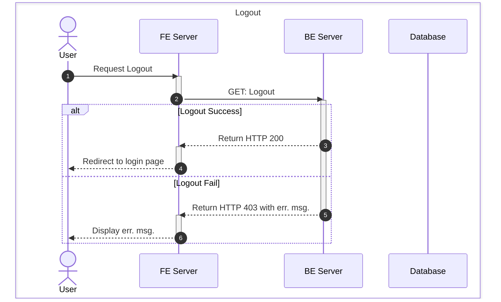

```mermaid
sequenceDiagram
    autonumber
    
    box Logout
        actor USR as User
        participant FE as FE Server
        participant BE as BE Server
        participant DB as Database
    end

    USR ->> FE: Request Logout
    activate FE
    FE ->> BE: GET: Logout
    deactivate FE
    activate BE
    alt Logout Success
        BE -->> FE: Return HTTP 200
        activate FE
        FE -->> USR: Redirect to login page
        deactivate FE
    else Logout Fail
        BE -->> FE: Return HTTP 403 with err. msg.
        deactivate BE
        activate FE
        FE -->> USR: Display err. msg.
        deactivate FE
    end

```