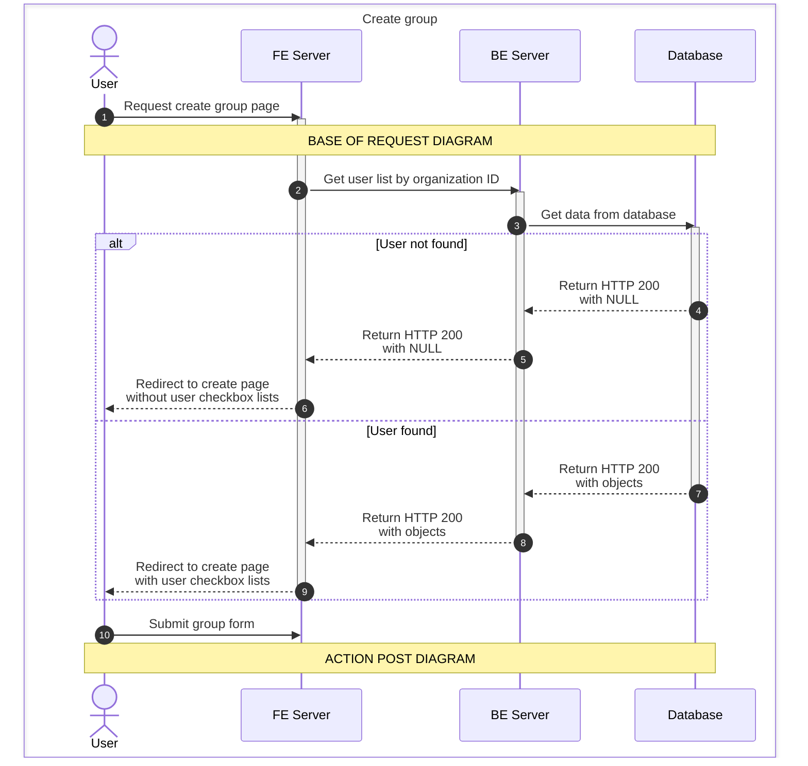

```mermaid
sequenceDiagram
    autonumber
    
    box Create group
        actor USR as User
        participant FE as FE Server
        participant BE as BE Server
        participant DB as Database
    end

    USR ->> FE: Request create group page
    activate FE
    note over USR, DB: BASE OF REQUEST DIAGRAM
    FE ->> BE: Get user list by organization ID
    activate BE
    BE ->> DB: Get data from database
    activate DB
    alt User not found
        DB -->> BE: Return HTTP 200 <br> with NULL
        BE -->> FE: Return HTTP 200 <br> with NULL
        FE -->> USR: Redirect to create page <br> without user checkbox lists
    else User found
        DB -->> BE: Return HTTP 200 <br> with objects
        deactivate DB
        BE -->> FE: Return HTTP 200 <br> with objects
        deactivate BE
        FE -->> USR: Redirect to create page <br> with user checkbox lists
        deactivate FE
    end
    USR ->> FE: Submit group form
    note over USR, DB: ACTION POST DIAGRAM
```