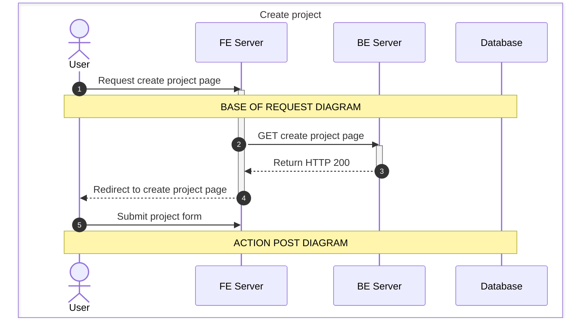

```mermaid
sequenceDiagram
    autonumber
    
    box Create project
        actor USR as User
        participant FE as FE Server
        participant BE as BE Server
        participant DB as Database
    end

    USR ->> FE: Request create project page
    activate FE
    note over USR, DB: BASE OF REQUEST DIAGRAM
    FE ->> BE: GET create project page
    activate BE
    BE -->> FE: Return HTTP 200
    deactivate BE
    FE -->> USR: Redirect to create project page
    deactivate FE

    USR ->> FE: Submit project form
    note over USR, DB: ACTION POST DIAGRAM
```