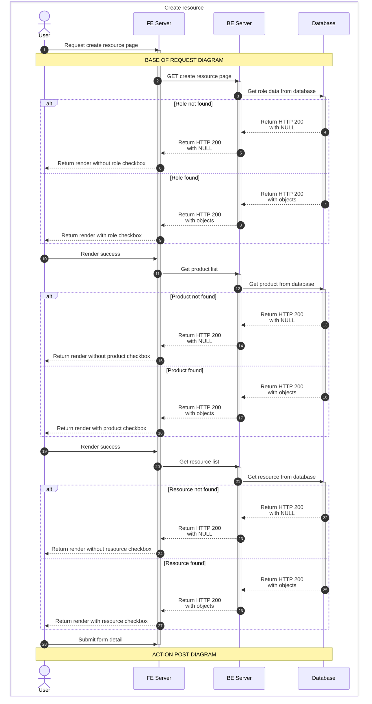

```mermaid
sequenceDiagram
    autonumber
    
    box Create resource
        actor USR as User
        participant FE as FE Server
        participant BE as BE Server
        participant DB as Database
    end

    USR ->> FE: Request create resource page
    activate FE
    note over USR, DB: BASE OF REQUEST DIAGRAM
    FE ->> BE: GET create resource page
    activate BE
    BE ->> DB: Get role data from database
    activate DB
    alt Role not found
        DB -->> BE: Return HTTP 200 <br> with NULL
        BE -->> FE: Return HTTP 200 <br> with NULL
        FE -->> USR: Return render without role checkbox
    else Role found
        DB -->> BE: Return HTTP 200 <br> with objects
        deactivate DB
        BE -->> FE: Return HTTP 200 <br> with objects
        deactivate BE
        FE -->> USR: Return render with role checkbox
    end
    USR ->> FE: Render success
    FE ->> BE: Get product list
    activate BE
    BE ->> DB: Get product from database
    activate DB
    alt Product not found
        DB -->> BE: Return HTTP 200 <br> with NULL
        BE -->> FE: Return HTTP 200 <br> with NULL
        FE -->> USR: Return render without product checkbox
    else Product found
        DB -->> BE: Return HTTP 200 <br> with objects
        deactivate DB
        BE -->> FE: Return HTTP 200 <br> with objects
        deactivate BE
        FE -->> USR: Return render with product checkbox
    end
    USR ->> FE: Render success
    FE ->> BE: Get resource list
    activate BE
    BE ->> DB: Get resource from database
    activate DB
    alt Resource not found
        DB -->> BE: Return HTTP 200 <br> with NULL
        BE -->> FE: Return HTTP 200 <br> with NULL
        FE -->> USR: Return render without resource checkbox
    else Resource found
        DB -->> BE: Return HTTP 200 <br> with objects
        deactivate DB
        BE -->> FE: Return HTTP 200 <br> with objects
        deactivate BE
        FE -->> USR: Return render with resource checkbox
    end
    USR ->> FE: Submit form detail
    deactivate FE
    note over USR, DB: ACTION POST DIAGRAM
```