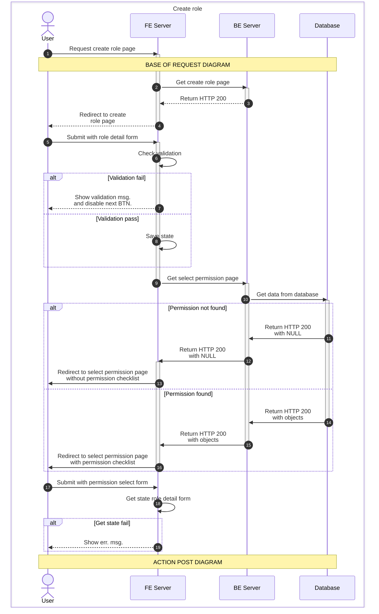

```mermaid
sequenceDiagram
    autonumber
    
    box Create role
        actor USR as User
        participant FE as FE Server
        participant BE as BE Server
        participant DB as Database
    end

    USR ->> FE: Request create role page
    activate FE
    note over USR, DB: BASE OF REQUEST DIAGRAM
    FE ->> BE: Get create role page
    activate BE
    BE -->> FE: Return HTTP 200
    deactivate BE
    FE -->> USR: Redirect to create <br> role page
    deactivate FE

    USR ->> FE: Submit with role detail form
    activate FE
    FE ->> FE: Check validation
    alt Validation fail
        FE -->> USR: Show validation msg. <br> and disable next BTN.
    else Validation pass
        FE ->> FE: Save state
    end
    FE ->> BE: Get select permission page
    deactivate FE
    activate BE
    BE ->> DB: Get data from database
    activate DB
    alt Permission not found
        DB ->> BE: Return HTTP 200 <br> with NULL
        BE ->> FE: Return HTTP 200 <br> with NULL
        activate FE
        FE ->> USR: Redirect to select permission page <br> without permission checklist
    else Permission found
        DB ->> BE: Return HTTP 200 <br> with objects
        deactivate DB
        BE ->> FE: Return HTTP 200 <br> with objects
        deactivate BE
        FE ->> USR: Redirect to select permission page <br> with permission checklist
        deactivate FE
    end

    USR ->> FE: Submit with permission select form
    FE ->> FE: Get state role detail form
    alt Get state fail
        FE -->> USR: Show err. msg.
    end
    note over USR, DB: ACTION POST DIAGRAM
```