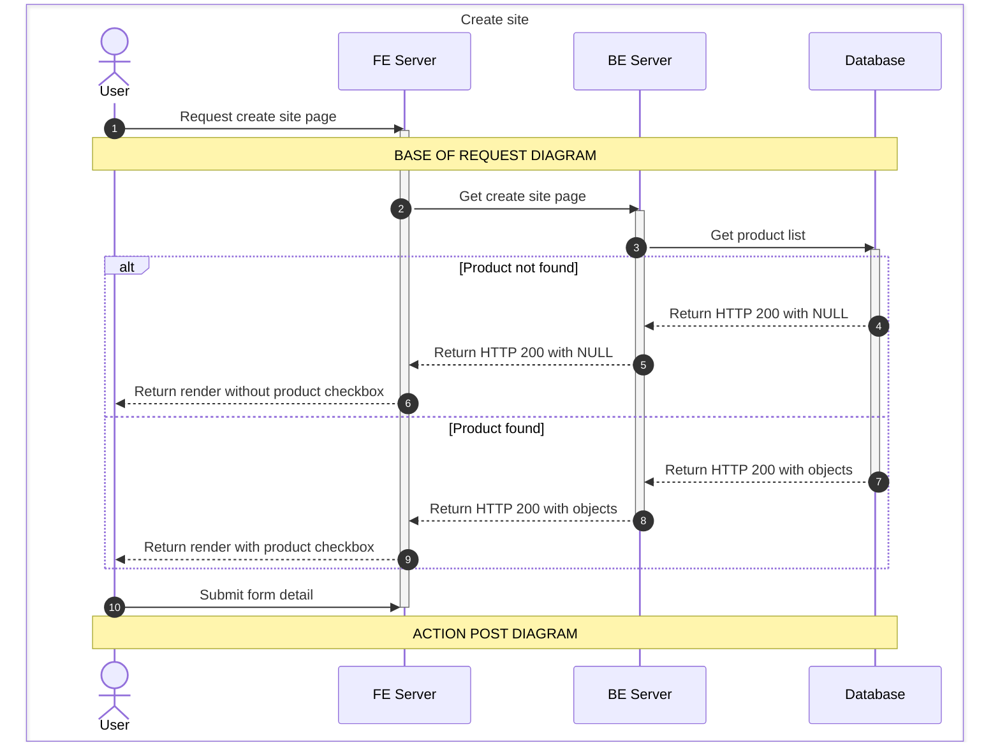

```mermaid
sequenceDiagram
    autonumber
    
    box Create site
        actor USR as User
        participant FE as FE Server
        participant BE as BE Server
        participant DB as Database
    end

    USR ->> FE: Request create site page
    activate FE
    note over USR, DB: BASE OF REQUEST DIAGRAM
    FE ->> BE: Get create site page
    activate BE
    BE ->> DB: Get product list
    activate DB
    alt Product not found
        DB -->> BE: Return HTTP 200 with NULL
        BE -->> FE: Return HTTP 200 with NULL
        FE -->> USR: Return render without product checkbox
    else Product found
        DB -->> BE: Return HTTP 200 with objects
        deactivate DB
        BE -->> FE: Return HTTP 200 with objects
        deactivate BE
        FE -->> USR: Return render with product checkbox
    end
    USR ->> FE: Submit form detail
    deactivate FE
    note over USR, DB: ACTION POST DIAGRAM

```